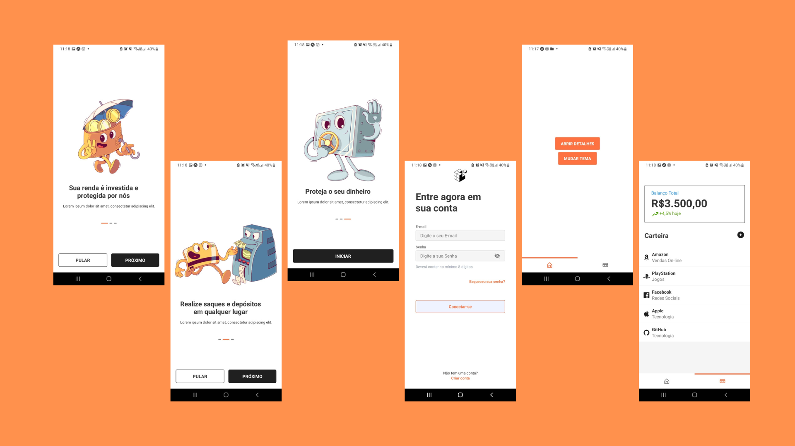

# Banking App - FrontEnd UI/UX

## Bem-vindo! 👋

Obrigado por avaliar esse código Front-End!

## 🏗 Construindo o Projeto

Primeiramente, certifique se em seu ambiente de desenvolvimento está instalado o "EXPO-CLI", se não,
instale o com o comando "npm install -g expo-cli" em seu terminal.

1. Clone o repositório em seu computador com "git clone".
2. Instale todas as dependencias, usando Yarn de preferência.
3. Agora, apenas inicie o projeto utilizando o comando "Expo Start"!

## ✨ Qualidades

A intuição desse código nessa "aplicação" é tornar mais fácil para iniciantes em programação.

- Incrível para iniciar um novo projeto!
- Fácil
- Lindo
- Minimalista
- Organizado

## Welcome! 👋

Thanks for checking out this front-end coding challenge.

## 🏗 Building your project

First, make sure that "EXPO-CLI" is installed in your development environment, if not,
install it with the command "npm install -g expo-cli" in your terminal.

1. Clone the repository to your computer.
2. Install all the dependency, using Yarn.
3. Just start the project now, let's go use "Expo Start"!

## ✨ Qualities

The intuition of coding this "application" is to make it easier for beginners in programming.

- Awesome to start a new project!
- Easy
- Beautiful
- Minimalist
- Organized
